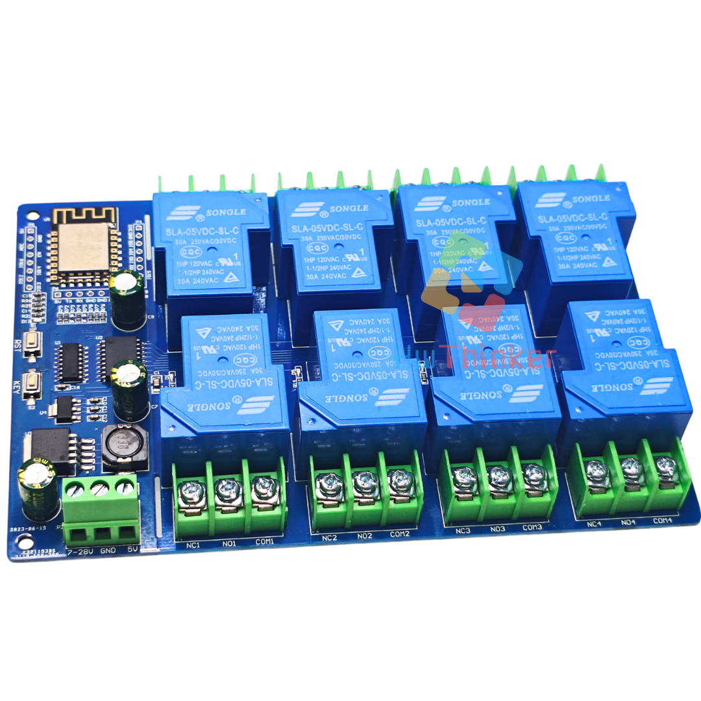
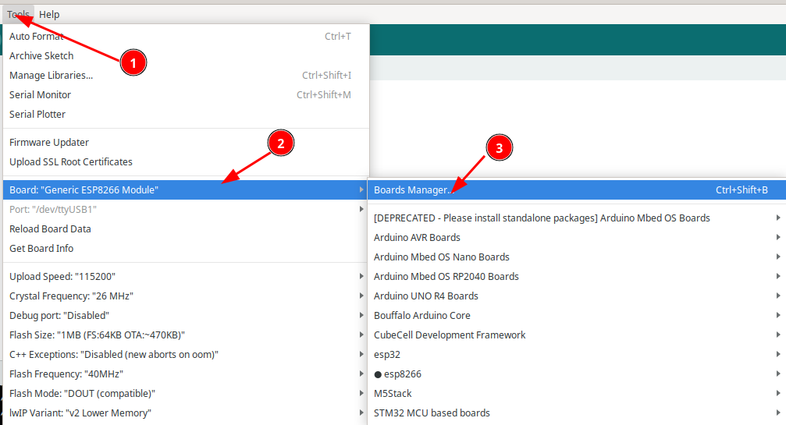
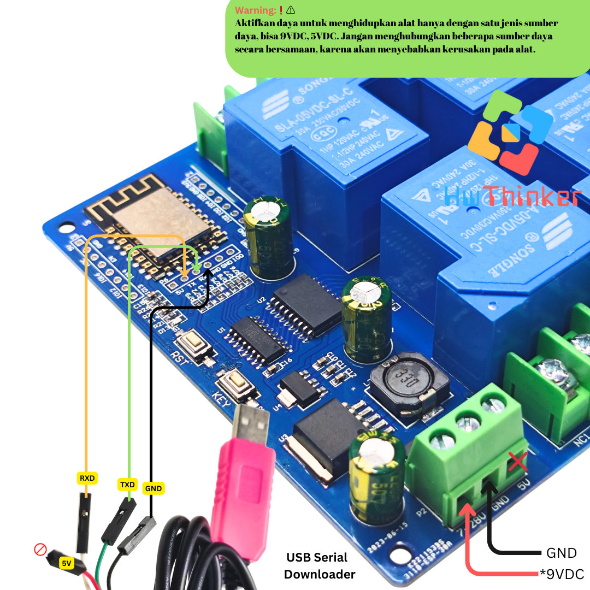
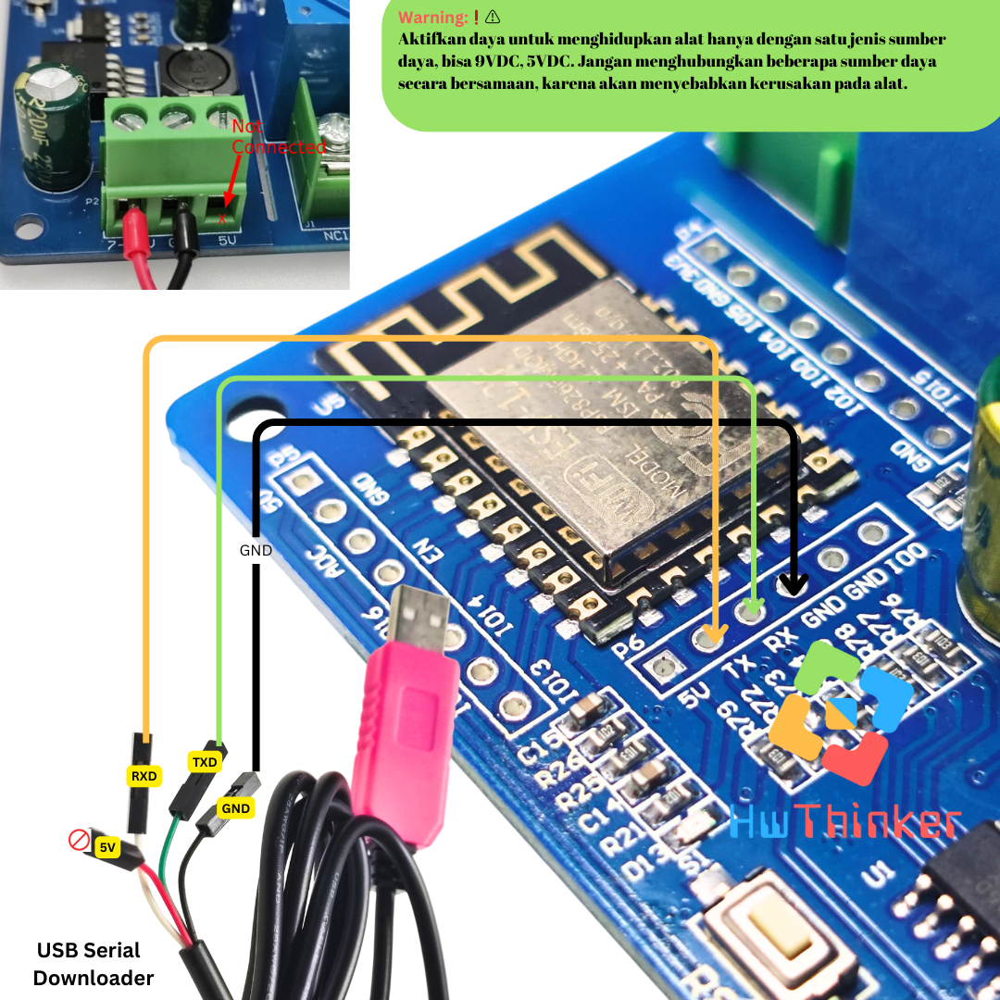

# Modul ESP8266 ESP-12f Relay 8 Channel 30A 


## Cara install plugin Arduino IDE

### Langkah 1: Buka Arduino IDE

1. Buka aplikasi Arduino IDE di komputer Anda. Jika belum ada, unduh dan instal Arduino IDE dari situs resmi Arduino di https://www.arduino.cc/en/software. disarankan menggunakan arduino ide versi 2

### Langkah 2: Tambahkan URL Board Manager untuk ESP8266

2. Di Arduino IDE, buka **File** > **Preferences**.

   

3. Pada bagian  Additional Boards Manager URLs, tambahkan URL berikut:

```
https://arduino.esp8266.com/stable/package_esp8266com_index.json
```

4. Jika sebelumnya Anda sudah memiliki URL lain di sana, pisahkan URL ini dengan tanda koma atau baris baru.


### Langkah 3: Buka Boards Manager

1. Buka **Tools** > **Board** > **Boards Manager**.



2. Di kotak pencarian, ketik **ESP8266**

### Langkah 4: Instal Board ESP8266

1. Temukan **ESP8266 by Espressif Systems** di daftar, kemudian klik **Install**.


2. Tunggu hingga proses instalasi selesai.

### Langkah 5: Pilih Board ESP8266

1. Setelah instalasi selesai, Anda dapat memilih board ESP8266.
2. Buka **Tools** > **Board**, dan gulir ke bawah untuk menemukan berbagai jenis board ESP8266 yang telah diinstal. Pilih board yang sesuai, misalnya **Nodemcu 1.0 (ESP-12E Module)** 


3. hasilnya kurang lebih seperti ini


### Langkah 6: Pilih Port

1. Sambungkan board esp8266 ke komputer Anda menggunakan kabel USB.
2. Di **Tools** > **Port**, pilih port yang sesuai dengan esp8266 Anda.

## Kode Program

```c++
//*****************************************
// Program check Modul Relay 8ch ESP-12F
// v1.0 september 17,2023 by HwThinker
// ****************************************

// ---Komunikasi Modul dengan serial programmer ----
// 5v-> x (not connected)
// tx-> rx(kabel putih)
// rx-> tx(kabel hijau)
// Gnd-> GND (kabel hitam)
// GND-> x (not connected)
// GPIO0->x (no connected)

// --- Prosedur upload -----
// 1. Tekan dan Tahan tombol Key (GPIO0)
// 2. Tekan dan lepas tombol reset
// 3. Lepas tombol Key
// 4. upload program sederhana(bisa blink lED arduino)
// 5. tunggu upload selesai
// 6. reset (wajib) supaya program baru running
// 7. Ulangi prosedur diatas bila upload program lagi.


#include <Arduino.h>

// hubungan koneksi antara PIN ESP-12F dengan  74HC595
const int latchPin = 12;   // Pin ST_CP (RCLK/12)
const int clockPin = 13;  // Pin SH_CP (SRCLK/11)
const int dataPin = 14;   // Pin DS (SER/14)
const int OE = 5;   // Pin OE (SER/13)

//untuk pin SRCLR(10) pada 74HC595 tidak sudah dikawatkan dengan VCC secara default.

const int LED_internal=2; //led internal pada modul ESP-12F
const int key = 0;   // Tombol  yang tersambung ke GPIO0

void setup() {
  // Atur pin sebagai OUTPUT
  pinMode(latchPin, OUTPUT);
  pinMode(clockPin, OUTPUT);
  pinMode(dataPin, OUTPUT);
  pinMode(OE, OUTPUT);
  pinMode(LED_internal, OUTPUT);
  digitalWrite(OE,LOW); //aktif LOW
}

void loop() {
  // Array untuk menyimpan pola LED
  byte rlyPola[] = {
    B00000001,
    B00000010,
    B00000100,
    B00001000,
    B00010000,
    B00100000,
    B01000000,
    B10000000
  };

  // Loop untuk menghidupkan Relay satu per satu
  for (int i = 0; i < 8; i++) {
    // Kirim pola ke 74HC595
    digitalWrite(latchPin, LOW);
    shiftOut(dataPin, clockPin, MSBFIRST, rlyPola[i]);
    digitalWrite(latchPin, HIGH);
    //blinky LED internal
    digitalWrite(LED_internal, !digitalRead(LED_internal));
    // Tunggu sebentar sebelum menghidupkan Relay berikutnya
    delay(800);
  }

  // Matikan semua LED
  digitalWrite(latchPin, LOW);
  shiftOut(dataPin, clockPin, MSBFIRST, B00000000);
  digitalWrite(latchPin, HIGH);

  // Tunggu sebentar sebelum mengulangi loop
  delay(1000);
}
```


## Cara download dengan Serial USB biasa

Pasang serial USB TTL dengan ketentuan: 

| Board | Serial USB          |
| ----- | ------------------- |
| 5v    | x (tidak terhubung) |
| txd   | rx ( Putih)         |
| rxd   | tx ( Hijau )        |
| GND   | GND ( Hitam )       |
| GND   |                     |
| GPIO0 | x (tidak terhubung) |




atau lebih jelas bisa cek




### Prosedur download

- Tekan dan Tahan tombol Key (GPIO0)
- Tekan dan lepas tombol reset
- Lepas tombol Key
- Upload program sederhana(bisa blink lED arduino)
- Tunggu upload selesai
- Reset (wajib) supaya program baru running
- Ulangi prosedur diatas bila upload program lagi.


## Warning:❗⚠️
Aktifkan daya untuk menghidupkan alat hanya dengan satu jenis sumber daya, bisa 9VDC atau 5VDC. Jangan menghubungkan beberapa sumber daya secara bersamaan, karena akan menyebabkan kerusakan pada alat.